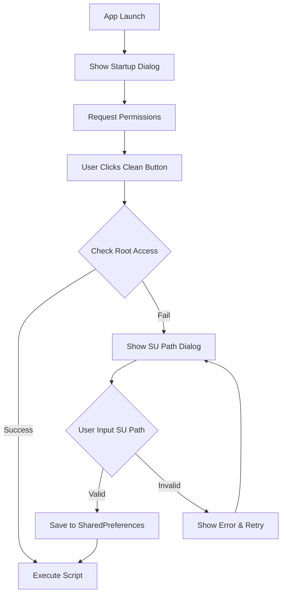

# Design Document: Custom SU Path Feature

## Overview

本设计为Android应用增加自定义SU路径功能和启动权限提示弹窗。主要包括：
1. 应用启动时显示权限请求和推广信息弹窗
2. Root权限检测失败时允许用户输入自定义SU路径
3. 使用SharedPreferences持久化存储SU路径配置
4. 修改Root命令执行逻辑以支持自定义SU路径

## Architecture



## Components and Interfaces

### 1. SuPathManager (新增类)

负责管理自定义SU路径的存储和验证。

```kotlin
class SuPathManager(private val context: Context) {
    companion object {
        private const val PREFS_NAME = "su_path_prefs"
        private const val KEY_CUSTOM_SU_PATH = "custom_su_path"
    }
    
    // 获取保存的SU路径，如果没有则返回默认"su"
    fun getSuPath(): String
    
    // 保存自定义SU路径
    fun saveSuPath(path: String)
    
    // 清除保存的SU路径
    fun clearSuPath()
    
    // 验证SU路径是否有效
    suspend fun validateSuPath(path: String): Boolean
    
    // 检查是否有自定义SU路径
    fun hasCustomSuPath(): Boolean
}
```

### 2. MainActivity 修改

#### 新增成员变量
```kotlin
private lateinit var suPathManager: SuPathManager
```

#### 新增方法

```kotlin
// 显示启动弹窗
private fun showStartupDialog()

// 显示SU路径输入对话框
private fun showSuPathInputDialog()

// 使用自定义SU路径检查Root权限
private suspend fun checkRootAccessWithCustomPath(suPath: String): Boolean

// 请求MANAGE_EXTERNAL_STORAGE权限 (Android 11+)
private fun requestManageStoragePermission()
```

#### 修改方法

```kotlin
// 修改 checkRootAccess() 使用 suPathManager.getSuPath()
private suspend fun checkRootAccess(): Boolean

// 修改 executeRootCommand() 使用 suPathManager.getSuPath()
private suspend fun executeRootCommand(command: String): String
```

### 3. 对话框设计

#### 启动弹窗 (Startup Dialog)
- 标题: "权限请求"
- 内容: "请给予文件管理权限和root权限\n\n刷机做环境找姜太公钓瑜\n电报频道 为@jiangtaigong7"
- 按钮: "确定"

#### SU路径输入对话框 (SU Path Input Dialog)
- 标题: "Root权限获取失败"
- 内容: "请给予root权限或者输入SU路径"
- 输入框: 提示文字 "例如: /system/xbin/su"
- 按钮: "确定" / "取消"

## Data Models

### SharedPreferences 存储结构

```
su_path_prefs (SharedPreferences文件名)
├── custom_su_path: String  // 自定义SU路径，默认为空
```

### 常用SU路径参考
- `/system/bin/su` (标准路径)
- `/system/xbin/su` (常见路径)
- `/sbin/su` (部分设备)
- `/su/bin/su` (SuperSU)
- `/magisk/.core/bin/su` (旧版Magisk)

## Correctness Properties

*A property is a characteristic or behavior that should hold true across all valid executions of a system-essentially, a formal statement about what the system should do. Properties serve as the bridge between human-readable specifications and machine-verifiable correctness guarantees.*

### Property 1: SU路径存储Round-trip一致性
*For any* valid SU path string, saving it via `saveSuPath()` and then retrieving it via `getSuPath()` should return the exact same string value.

**Validates: Requirements 3.1, 3.2**

### Property 2: 默认SU路径回退
*For any* state where no custom SU path is saved (empty or cleared), `getSuPath()` should return the default value "su".

**Validates: Requirements 4.4**

### Property 3: 自定义路径优先使用
*For any* configured custom SU path, when executing root commands, the system should use that custom path instead of the default "su" command.

**Validates: Requirements 3.3, 4.1, 4.2**

### Property 4: 启动弹窗一致性
*For any* application launch, the startup dialog should be displayed with the required permission request and promotional text.

**Validates: Requirements 1.4**

## Error Handling

| 错误场景 | 处理方式 |
|---------|---------|
| 标准Root权限检测失败 | 显示SU路径输入对话框 |
| 自定义SU路径验证失败 | 显示错误提示，允许重新输入 |
| 自定义SU路径执行命令失败 | 提示用户更新SU路径或授予标准Root权限 |
| 文件权限被拒绝 | 显示说明并引导用户到系统设置 |
| SharedPreferences读写失败 | 回退到默认"su"命令 |

## Testing Strategy

### Unit Tests
- 测试SuPathManager的路径存储和读取
- 测试空路径时的默认值回退
- 测试路径清除功能

### Property-Based Tests
- Property 1: 使用随机生成的有效路径字符串测试存储一致性
- Property 2: 测试各种初始状态下的默认值行为

### Integration Tests
- 测试完整的Root权限检测流程
- 测试对话框显示和用户交互流程

### 测试框架
- 使用JUnit 4进行单元测试
- 使用Kotest进行属性测试 (Property-Based Testing)
- 使用Espresso进行UI测试
